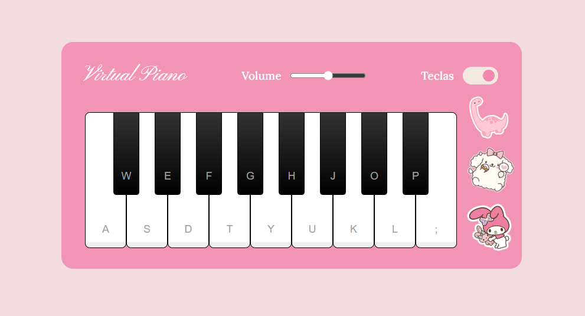

# piano simulator 🎹

um simulador de piano interativo feito com html, css e javascript.  
o projeto permite tocar notas usando o teclado do computador e clicar nas teclas na tela.

## 🔗 demo

[piano simulator](https://scriptlver.github.io/piano-simulator/)

## 💗 tecnologias

- html
- css
- javascript

## 💕 funcionalidades

- tocar notas pelo teclado
- tocar notas clicando nas teclas
- interface simples e interativa
- efeitos sonoros em tempo real
- design inspirado em um piano virtual

## 💌 objetivo

esse projeto foi desenvolvido para praticar:

- manipulação do dom
- eventos no javascript
- responsividade
- estilização com css
- interação com áudio

## 📸 preview

adicione aqui uma screenshot do projeto depois 👀

```md

```

## ❣️ como executar

```bash
git clone https://github.com/scriptlver/piano-simulator.git
```

depois abra o arquivo `index.html` no navegador.
